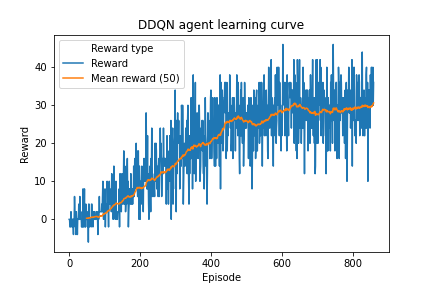
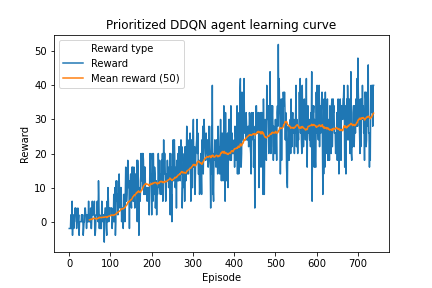
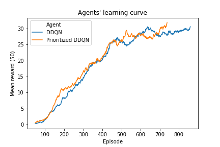

# DQN Agent for the Banana Environment

### 1. Network architecture

A very simple architecture of just two fully connected layers of 256 and 64 neurons was enough to very quickly solve the environment.

From the experience with Deep Q-Learning agents on the Lunar Lander and Banana environments one could pose the following rule of thumb for deciding about the size of the first fully connected layer:
- estimate the number of distinct environment features the agent should learn,
- set the number of neurons to the closest power of 2.
In the case of the Banana environment one can think of the following situations:
- there are 7 rays coming out of the agent, each ray can have a yellow banana, a blue banana, a wall or nothing in it - that's 28 features,
- each of these can be combined with rough distances of close, average, far - this gives 84 feautures,
- finally there can be several velocities (let's say 3) of the agent and we arrive at around 252 features to learn.

### 2. Learning parameters

The learning parameters used were very typical but worked very well:
- buffer size - 100 000,
- batch size - 64,
- gamma - time discount - 0.99,
- tau - 1 / 1000,
- learning rate - 5 / 10000,
- alpha (the power in probabilities in Prioritized DQN) - 1.0,
- beta (the power in importance-sampling weighing) - 1.0.

### 3. Learning process

The learning process of both the Double DQN and Prioritized Double DQN networks was very stable. This is probably due to a very tame nature of the banana environment. There are no sudden jumps in the score and the agent can't die.

The charts below show the learning curves of both agents.

DDQN needed just over 300 episodes to solve the environment and get to the score of 13, while Prioritized DDQN needed just 277. It seems that prioritized replay buffer helped the agent to achieve better scores earlier, which is easy to explain - the random behavior at the beginning of training produces many random walks which do not hit any banana. Prioritized replay buffer uses those rare occasions when the random agent walks into a banana more often for training.

### 4. Ideas for future improvements

The game was solved so quickly by both agent that it is hard to think of future improvements. Of course, a human can play this game from the get-go, because a human understands that probably the objects on the map are the only important feature. Therefore one could think of two improvements:
1. Instead of storing just a single transition one could store paths of transitions. Then if a path ends in large reward change, an entire sequence would be taken to the training batch. However, this runs into the risk of actually putting too much correlation from consequtive frames into the network and bringing back the problem which sampling the replay buffer is solving.
2. One could replace the very naive epsilon-greedy exploration with a more sophisticated one. Maybe it could be driven by a separate network for learning the value of knowledge, like in a knowledge gradient algorithm. Or maybe this network could just model the reward uncertainty for all states. This way it could be explicitly used to estimate the value of exploration.

A simple improvement that probably would help the agent too would be to use a dueling network. Because for most states the action taken has little impact on its score, the value function should capture most of the important information quicker.